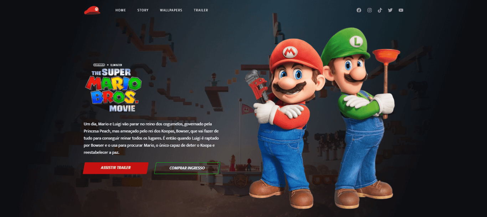

<h1 align="center">
  The Super Mario Bros
</h1>

  

## Projeto - The Super Mario Bros

O site oferece uma breve introdução ao filme "The Super Mario Bros". Possui uma estrutura bem organizada e responsiva, seguindo o padrão clean code. Além disso, apresenta estilos elegantes para proporcionar uma boa experiência ao visitante.

Tecnologias Utilizadas:
* [HTML (Linguagem de marcação):](https://www.w3schools.com/html/html_intro.asp) Utilizado para estruturar e definir o conteúdo da página, incluindo cabeçalhos, parágrafos, listas e imagens.
* [CSS (Folha de estilos em cascata):](https://www.w3schools.com/css/css_intro.asp) Utilizado para estilizar os elementos da página, definindo cores, tamanhos, fontes e layout, proporcionando uma aparência visualmente atraente.
* [AOS:](https://michalsnik.github.io/aos/) É uma biblioteca JavaScript utilizada para criar animações em elementos HTML à medida que eles se tornam visíveis na tela durante a rolagem da página.
* [TinyJPG](https://tinyjpg.com/) e [TinyPNG:](https://tinypng.com/) O site utilizado é uma ferramenta online que comprime imagens JPEG e PNG sem perder muita qualidade. Ele reduz o tamanho dos arquivos de imagem usando algoritmos eficientes de compressão.
* [Google Fonts:](https://fonts.google.com/specimen/Mukta?query=Mukta) Utilizado para acessar e aplicar fontes personalizadas aos textos da página, melhorando a estilização e a legibilidade.

Créditos:
* Criado com base do Canal no YouTube | [Leo Vargas](https://www.youtube.com/watch?v=6Ok-kUrBGp8&ab_channel=LeoVargas)
* [Link do site oficial](https://www.thesupermariobros.movie/)

Implantação do Projeto no Vercel: [Explore o projeto clicando aqui.](https://site-filme-super-mario-bros.vercel.app/)

---

## Project - The Super Mario Bros

The site offers a brief introduction to the movie "The Super Mario Bros". It has a well-organized and responsive structure, following the clean code standard. It also features elegant styles to provide a good visitor experience.

Technologies used:
* [HTML (HyperText Markup Language):](https://www.w3schools.com/html/html_intro.asp) Used to structure and define page content, including headings, paragraphs, lists and images.
* [CSS (Cascading Style Sheets):](https://www.w3schools.com/css/css_intro.asp) Used to style the elements of the page, defining colors, sizes, fonts and layout, providing a visually appealing appearance.
* [AOS:](https://michalsnik.github.io/aos/) It's a JavaScript library used to create animations on HTML elements as they become visible on the screen while scrolling.
* [TinyJPG](https://tinyjpg.com/) e [TinyPNG:](https://tinypng.com/) The website used is an online tool that compresses JPEG and PNG images without losing much quality. It reduces the size of image files using efficient compression algorithms.
* [Google Fonts:](https://fonts.google.com/specimen/Mukta?query=Mukta) Used to access and apply custom fonts to page texts, improving stylization and readability.

Credits:
* Created on the basis of the YouTube channel | [Leo Vargas](https://www.youtube.com/watch?v=6Ok-kUrBGp8&ab_channel=LeoVargas)
* [Official website link](https://www.thesupermariobros.movie/)

Project deployment on Vercel: [Explore the project by clicking here.](https://site-filme-super-mario-bros.vercel.app/)
